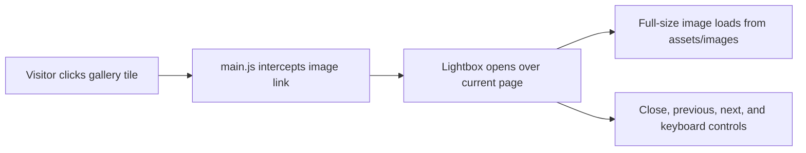
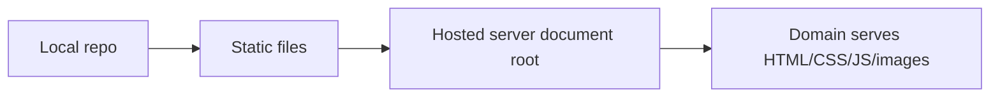

# ESSF Website Concepts

This repo is a static website for Ek Soach Saathiya Foundation. The production behavior comes from browser-rendered HTML, CSS, JavaScript, and image files; no backend is required for the current site.

## Viewing Full Images

Gallery thumbnails link directly to their image files as a fallback. JavaScript upgrades those links into an in-page lightbox so visitors can view the full photo without leaving the site.

## Deployment Model

The 20 GB hosted server is mainly storage and bandwidth for static files. Upload the same folder structure to the domain host, keeping `index.html`, `css/`, `js/`, `pages/`, and `assets/` paths intact.

