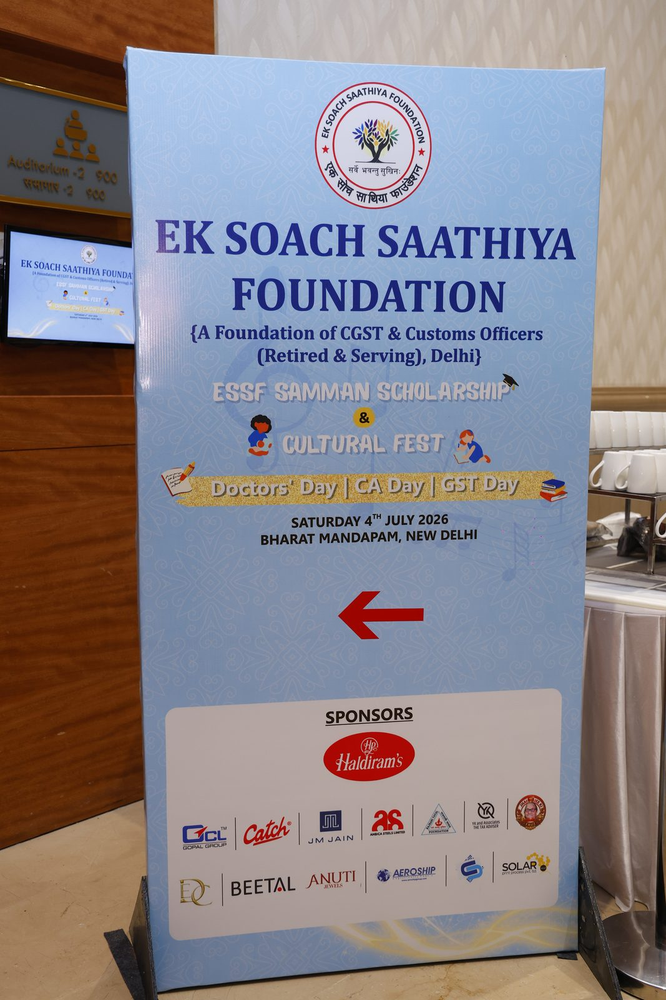
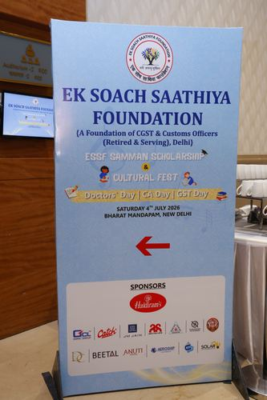

# Interface Contracts — 222-photo gallery build

Every interface this change introduces or modifies. "API" here means CLI signatures, file formats, and
the HTML/JS contracts the shared scripts depend on — there is no network API in this system.

---

## `scripts/optimize-images.py` — modified

Currently hard-codes `MAX_DIMENSION = 1600` and `JPEG_QUALITY = 82` as module constants and takes two
positional arguments. The two-tier design (ADR-002) needs both settings overridable per run.

```
python3 scripts/optimize-images.py <input_dir> <output_dir> [--max-dim N] [--quality Q]
```

| Argument | Type | Default | Meaning |
|---|---|---|---|
| `input_dir` | path | required | Folder of raw images. Not recursed. |
| `output_dir` | path | required | Created if absent. Existing files overwritten. |
| `--max-dim` | int | `1600` | Long-edge cap in pixels. Never upscales. |
| `--quality` | int | `82` | JPEG quality, 1–95. |

Defaults preserve today's behavior exactly, so existing invocations in `OPEN_ISSUES.md` and `README.md`
keep working unchanged.

**Invariants.** Output is always `<sanitised-stem>.jpg`, RGB, EXIF-transposed, aspect ratio preserved.
Inputs are filtered to `.jpg/.jpeg/.png/.webp`. An image already smaller than `--max-dim` is re-encoded
at the given quality but not enlarged — `Image.thumbnail()` only shrinks.

**Filename sanitisation** (added for this change, see ADR-004). Applied to the stem before writing:

| Rule | Pattern | Example |
|---|---|---|
| Parenthesised series | `NAME (N)` → `NAME_NN` | `DSC_1199A (5)` → `DSC_1199A_05` |
| Short numeric suffix | `LETTERS_N` with 1–3 digits → pad to 4 | `DSC_460` → `DSC_0460` |
| Fallback | spaces → underscores | `my photo` → `my_photo` |

The rules are mutually exclusive and applied in that order, so a series name never also gets 4-padded
(`DSC_1199A_05` must not become `DSC_1199A_0005`). Verified against all 222 source names: 222 unique
outputs, none containing spaces or parentheses, and all 22 filenames already on disk reproduced exactly.

**Errors.** Missing input dir → message and exit 1. Bad `--quality` outside 1–95 → message and exit 1.
Two source files whose stems sanitise to the same output → message and exit 1, rather than silently
overwriting. An undecodable file raises and aborts the run, by design: a corrupt input should be fixed
at stage 3, not silently skipped mid-batch.

**The two invocations for this change:**

```bash
python3 scripts/optimize-images.py <staging> assets/images/events/04-07-2026
python3 scripts/optimize-images.py <staging> assets/images/events/04-07-2026/thumbs --max-dim 500 --quality 78
```

---

## `scripts/fetch-drive-folder.py` — new

```
python3 scripts/fetch-drive-folder.py <folder_url> <staging_dir> [--manifest PATH] [--enumerate-only]
```

| Argument | Type | Default | Meaning |
|---|---|---|---|
| `folder` | str | required | Public Drive folder URL or bare folder ID. |
| `staging_dir` | path | required | Download destination. Created if absent. |
| `--manifest` | path | `<staging_dir>/manifest.json` | Where the enumeration is written and re-read. |
| `--enumerate-only` | flag | off | Write the manifest, download nothing. |

**Enumeration source.** `https://drive.google.com/embeddedfolderview?id=<id>#list` — server-rendered,
returns every entry in one response, no pagination and no 50-file cap. The normal
`/drive/folders/<id>` page is **not** usable: it returns HTTP 200 with a valid `<title>` but renders its
listing client-side, so the file names are absent from the served HTML.

Entries are parsed per `class="flip-entry"` chunk, pairing `id="entry-<drive_id>"` with the adjacent
`flip-entry-title`. Chunking per entry matters — a global regex would pair a missing title with the
next entry's ID and silently shift the whole mapping.

**Behavior.** If the manifest exists it is reused rather than re-enumerating. Downloads are sequential
(parallel requests earn rate-limiting that looks identical to a permissions error), and any file already
present and non-empty in `staging_dir` is skipped — so re-running is the retry mechanism (see
`logic_flow.md` stage 2).

**Exit codes.** `0` all files present. `1` enumeration failed — zero IDs found, or the fetch returned a
sign-in page. `2` one or more downloads failed; the failures are listed on stderr and the successfully
downloaded files are left in place.

**Explicitly not handled.** Files over 100MB, which need Google's virus-scan confirm-token round trip.
None are expected at ~13MB per photo; if one appears, the response will be HTML and it will be reported
as a failed download rather than silently written as a corrupt file.

---

## `manifest.json` — new

Written to the staging folder by `fetch-drive-folder.py`, then enriched by the emitter with output
dimensions. Not deployed — staging is outside the working tree, so this file never reaches the repo or
the server. It exists to make the enumeration re-usable and the tier-drift in ADR-002 detectable.

```json
{
  "source_folder": "1LjINm4bXNpIQdWcG-vboCsVYQst2pYR5",
  "fetched_at": "2026-08-17T00:00:00Z",
  "count": 222,
  "files": [
    {
      "drive_id": "1AbC...",
      "name": "DSC_0132.JPG",
      "downloaded": true,
      "bytes": 13045881,
      "full": { "path": "assets/images/events/04-07-2026/DSC_0132.jpg", "w": 1600, "h": 1067 },
      "thumb": { "path": "assets/images/events/04-07-2026/thumbs/DSC_0132.jpg", "w": 500, "h": 333 }
    }
  ]
}
```

`full` and `thumb` are absent until the optimize passes have run. `drive_id` is the field that makes
item 4 in `OPEN_ISSUES.md` tractable later — when the client sends scholarship recipient names keyed to
what they see in Drive, this is the join column.

---

## Gallery tile — modified HTML contract

The existing pattern, used on every gallery in the site, points `src` and `href` at the same file:

```html
<div class="gallery-item">
  <a href="../assets/images/events/04-07-2026/DSC_0132.jpg" target="_blank" rel="noopener">
    
  </a>
  <div class="overlay">View Full</div>
</div>
```

On the new page only, they diverge — `src` gets the thumbnail, `href` keeps the full size:

```html
<div class="gallery-item">
  <a href="../assets/images/events/04-07-2026/DSC_0132.jpg" target="_blank" rel="noopener">
    
  </a>
  <div class="overlay">View Full</div>
</div>
```

**Required of every tile:** exactly one `<a href>` (the lightbox indexes on this), `loading="lazy"`,
non-empty `alt`, and relative paths starting `../` since the page lives in `pages/`.

**The four existing galleries are unchanged.** Their `src` and `href` stay identical, and the two forms
coexist because the lightbox only ever reads `href`.

---

## `main.js` lightbox — unchanged, but depended upon

No edit to `js/main.js` is proposed. The change relies on three properties of the existing code, listed
here because they are load-bearing and silent:

It collects `document.querySelectorAll('.gallery-item a[href]')` across the whole document, so a page
with 222 tiles needs no registration and no per-page configuration.

It sets `lightboxImg.src = link.href` — the anchor's href, never the thumbnail's `src`. This is the
single line that makes the two-tier split work without touching the lightbox.

It reads `alt` from the tile's `` for the caption, so thumbnail and full-size share alt text and
the caption is unaffected by the tier split.

If any of these changes, the two-tier design breaks quietly — the lightbox would start showing 500px
images full-screen with no error. `logic_flow.md` stage 7 verifies this explicitly rather than trusting
it.

---

## Emitter markers — new HTML contract

`pages/gallery-bharat-mandapam.html` is hand-written except for one generated region, delimited so the
emitter can be re-run idempotently:

```html
<div class="gallery-grid">
  <!-- BEGIN GENERATED TILES -->
  ...222 .gallery-item blocks...
  <!-- END GENERATED TILES -->
</div>
```

The emitter replaces everything strictly between the markers and touches nothing else. Both markers must
be present and in order; if either is missing it stops rather than guessing, because the failure mode of
guessing is overwriting a hand-written page.

---

## Asset path contract

| Path | Contains | Approx. |
|---|---|---|
| `assets/images/events/04-07-2026/*.jpg` | 222 full-size, 1600px q82 | ~47 MB |
| `assets/images/events/04-07-2026/thumbs/*.jpg` | 222 thumbnails, 500px q78 | ~9 MB |

Stems match exactly across the two folders — this is the invariant the emitter checks before writing
(see `logic_flow.md` stage 6). `thumbs/` sits inside the event folder rather than in a parallel
`thumbs/events/04-07-2026/` tree so that deleting an event deletes both tiers in one move.

---

## Open questions

`--max-dim` and `--quality` are the minimum needed for two tiers. A `--suffix` option that writes
`name-thumb.jpg` into a single folder instead of a separate one would avoid the parallel directory
entirely, but it makes the invariant harder to check by listing and makes bulk deletion messier. Not
proposed; noted in case the folder split proves annoying in practice.

The emitter is described here as a contract but not yet located — it can live in
`scripts/build-gallery.py` as a permanent tool or as a throwaway in the scratchpad. Making it permanent
is only worth it if the other three galleries get the same treatment, which is undecided
(`architecture.md`, open questions).
