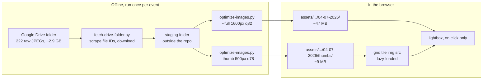
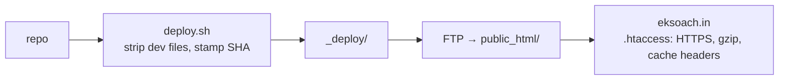

# Architecture — ESSF Website

Supersedes `CONCEPTS.md`. That file described the lightbox and the deployment model; both are folded
in below. Delete `CONCEPTS.md` once this is approved so there is only one description of the system.

Scope of this document: the whole static site as it stands, plus the change currently in flight —
publishing all 222 photos from the 4 July 2026 Bharat Mandapam event on a dedicated gallery page.

---

## Complexity tier

**Single-process static site with an offline asset pipeline.**

There is no server, no database, no build step, and no framework. The production artifact is a folder
of HTML, CSS, JS, and JPEGs uploaded to a document root. The only "program" in the repo is
`scripts/optimize-images.py`, which runs on a laptop, produces JPEGs, and is never invoked at request
time.

This is the right tier and I want to be explicit about why, because the 222-photo requirement is the
kind of thing that tempts people upward. The obvious next tiers would be a static site generator
(Eleventy, Hugo) to template the gallery tiles instead of writing them out, or an image CDN
(Cloudinary, imgix) to serve responsive sizes on demand. Both are wrong here. A generator would add a
Node toolchain and a build step to a repo whose contributors' workflow is "edit HTML, run deploy.sh" —
the templating saves you writing ~222 near-identical `
` blocks, which a 30-line Python emitter
also does without introducing a dependency anyone has to install. A CDN would add a paid external
dependency and a runtime failure mode to a site that currently has neither, to solve a problem
(serving two image sizes) that two folders of pre-generated files solve for free.

The one thing that genuinely gets harder at 222 photos is page weight, and that is an asset-pipeline
problem, not an architecture problem. See ADR-002.

---

## Components

The system has four parts, and only the first two exist at request time.

**Static documents** — `index.html` and the five pages under `pages/`. Each is a complete, standalone
HTML file that duplicates the nav, the head, and the footer. This duplication is deliberate: it is what
lets the site have no build step. The cost is that a nav change means editing every page, which is
tolerable at six pages and would not be at sixty.

**Shared behavior** — `css/style.css` and `js/main.js`, linked from every page with a `?v=N`
cache-buster. `main.js` carries three independent blocks: the hamburger nav, the hero slider (only
active if `.hero` is present), and the lightbox (only active if `.gallery-item a[href]` matches). Each
block feature-detects its own DOM and no-ops otherwise, which is why one shared script can serve pages
with wildly different content.

**Image assets** — `assets/images/`, organised by section, with events keyed by date folder
(`events/04-07-2026/`). Today each photo exists in exactly one size, used for both the grid thumbnail
and the lightbox. The change in flight adds a second size tier; see the data flow below.

**The offline pipeline** — `scripts/optimize-images.py`, which turns a folder of raw camera JPEGs into
web-sized JPEGs. It is the boundary between "what the photographer shot" and "what the repo contains."
Nothing raw is ever committed.

---

## Data flow — photo to page

The pipeline runs once per event, on a laptop, and its output is committed. The dashed boundary is the
important one: everything left of it is a manual step done once; everything right of it is what a
visitor on a 2G phone actually pays for.

*The visitor loads only the thumbnails their scroll position reaches, and pays for a full-size photo
only when they click one.*

The two-tier split is the whole point of the change. With one tier, a visitor scrolling the full
222-tile grid downloads ~47MB. With two, they download ~9MB for the same scroll, and each full photo
they actually open costs ~215KB on top. See ADR-002 for what this costs in exchange.

---

## Viewing full images (from `CONCEPTS.md`)

Every gallery tile is an `<a href>` pointing at the full-size JPEG, so the gallery works with
JavaScript disabled — the link just opens the photo in a new tab. `main.js` then upgrades those links
into an in-page lightbox with prev/next and keyboard control, by intercepting the click. This
progressive-enhancement shape matters for the change in flight: the tile's `href` stays the full-size
path even though its `img src` becomes the thumbnail path, so the no-JS fallback still gets the good
photo.

---

## Deployment shape (from `CONCEPTS.md`)

`deploy.sh` copies the repo into `_deploy/`, strips dev files (`.git`, `.github`, `.claude`, `*.md`,
`deploy.sh`), and rewrites the `?v=` cache-buster to the current git SHA. The contents of `_deploy/`
go to `public_html/` on the eksoach.in shared host, by FileZilla or by `lftp mirror` if FTP env vars
are set. The mirror never deletes, so the legacy Indiafin files already in `public_html/` are left
alone.

*Nothing reaches the live server until step 4; `_deploy/` is reviewable locally first.*

The 20GB hosting plan is not a constraint at any point here. The site is ~11MB today and ~67MB after
this change. The constraint that binds is visitor bandwidth on a slow connection, not server storage —
which is why the thumbnail tier matters and the disk cost of storing two sizes does not.

---

## Boundaries and invariants

Raw camera files never enter the repo. Staging happens outside the working tree so a stray `git add`
cannot pull in 2.9GB.

Every path in HTML is relative and root-agnostic (`../assets/...` from `pages/`), because the site is
served both from a GitHub Pages subpath (`/ESSF/`) and from a domain root (`eksoach.in`). Any absolute
path breaks one of the two.

`main.js` and `style.css` are shared by all pages; a new page gets them with the same `?v=N` as every
other page, and adding a page means bumping nothing. Changing their *contents* means bumping `?v=` on
all pages at once.

---

## Open questions

The 222 raw files have not been downloaded yet, so the ~2.9GB estimate is extrapolated from a single
13MB sample file in `~/Downloads`. Actual total could plausibly be 1.5–4GB. This changes how long the
download takes, not whether the design works.

`README.md` claims "Images compressed to ≤500px thumbnails (~25KB each)" and "~6MB for 236
thumbnails." Neither matches the repo: `assets/images/` is 11MB and the 04-07-2026 photos average
215KB at 1600px. The README describes an earlier compression setting that `optimize-images.py`
(1600px, q82) no longer implements. I have not corrected the README, because doing so is a separate
edit from this change — but the two-tier split proposed here makes the README's description accurate
again for the thumbnail tier specifically, so it may be worth folding the correction in.

Whether the other three event galleries (which show 8 photos each out of 67/12/140 on disk) should
also get dedicated full-gallery pages is not decided. This design does not preclude it — the page
shape is reusable — but it is out of scope for this change.
