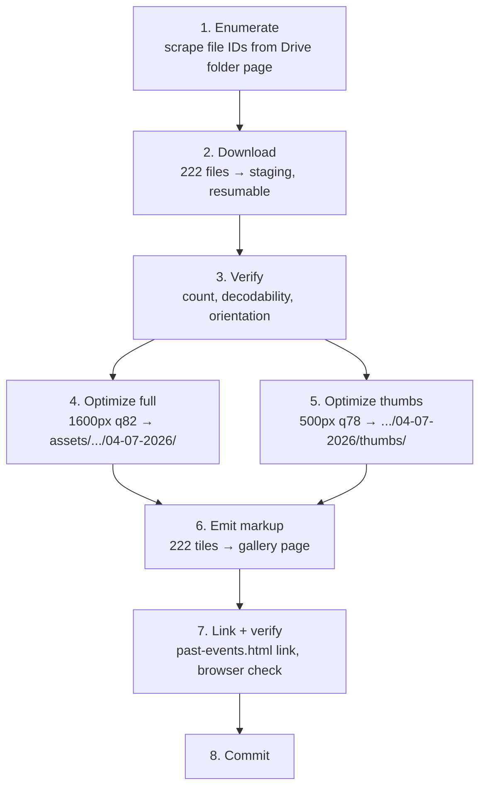
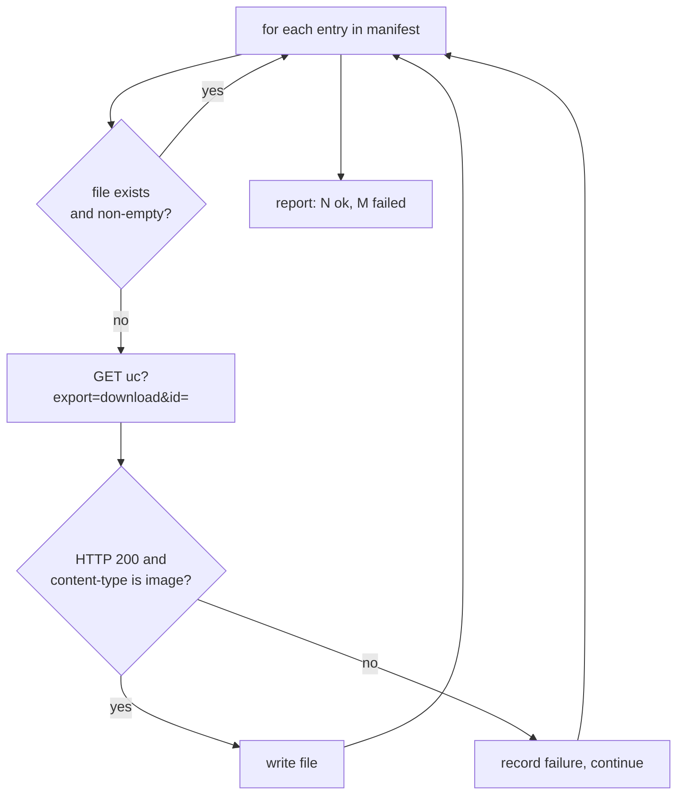
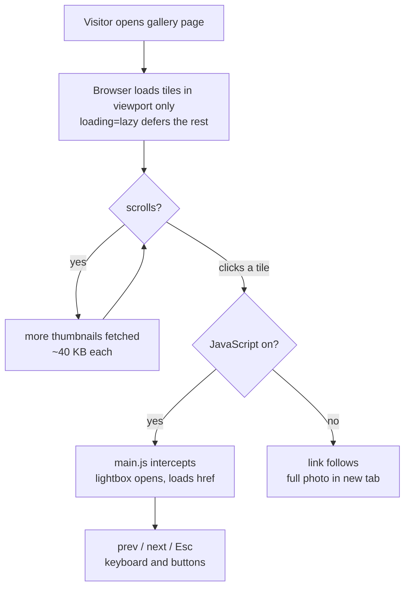

# Logic Flow — 222-photo gallery build

Execution paths for the one-time pipeline that takes the Bharat Mandapam photos from Google Drive to a
published page, plus the runtime path a visitor takes through the finished gallery.

---

## Stage overview

*Stages 4 and 5 are independent and read the same staging folder; everything else is strictly ordered.*

Staging lives outside the working tree — `/private/tmp/.../scratchpad/bharat-raw/` — so that no
accidental `git add -A` can pull 2.9GB of raw camera files into the repo.

---

## Stage 1 — Enumerate

The Drive folder page, fetched without authentication, embeds its file listing in a JavaScript blob
rather than in the DOM as ordinary elements. The file IDs are extractable by regex against the 33-char
Drive ID pattern paired with the adjacent filename string.

The script writes `manifest.json` before downloading anything. This is deliberate: the enumeration is
the fragile step (ADR-003), and having its result on disk means a download interrupted at photo 180
resumes without re-scraping, and means a failure to enumerate is distinguishable from a failure to
download.

**Failure — fewer than 222 IDs found.** Stop, do not proceed to download. Either Google changed the
page shape or the folder's sharing was tightened. Report the count found and the first few IDs so the
difference is diagnosable. Falling through to a partial download is the bad outcome here, because a
partial gallery looks complete.

**Failure — more than 222.** Also stop and report. The folder may contain videos or subfolders; the
count is the client's stated number and a mismatch means the assumption is stale.

---

## Stage 2 — Download

Sequential, one file at a time, each to `staging/<original-name>`. Sequential rather than parallel
because Google rate-limits unauthenticated `uc?export=download` fetches aggressively and a burst of
parallel requests earns a temporary block that looks exactly like a permissions error.

Before each fetch, if the destination exists and its size is non-zero, skip it. This makes the whole
stage resumable: interrupt it, re-run it, and it picks up where it stopped.

*A failed file does not abort the run — the failures are collected and reported at the end so one bad
file does not cost 200 good downloads.*

**Failure — HTML response instead of an image.** This is Google's sign-in page or its virus-scan
interstitial. Record and continue; the end-of-run report names the failures for a manual retry. Do not
retry automatically in-loop, because if the cause is rate-limiting, retrying immediately deepens it.

**Retry policy.** None automatic. Re-running the script is the retry, and the skip-if-exists check makes
that cheap and safe.

---

## Stage 3 — Verify

Three checks before any pixels are processed, because a bad input discovered at stage 6 costs the whole
pipeline.

Count matches the manifest. Every file opens and decodes in Pillow — a truncated download often has a
plausible size but fails to decode. And an orientation report: for every image, its pixel dimensions and
its EXIF orientation tag.

That third check exists because of a known trap in this exact dataset. `OPEN_ISSUES.md` records that
`DSC_1025.jpg` and `DSC_1199A_05.jpg` were shot portrait but carry no EXIF rotation flag, and had to be
rotated by hand in the previous batch. `ImageOps.exif_transpose()` cannot fix what EXIF does not record.

**Corrected during implementation (2026-08-17).** The check originally specified here — flag every image
stored landscape with no orientation tag — is worthless on this dataset. Measured against the first 128
downloads, **127 of 128 match that description**, because the camera shot almost everything in landscape
and correctly wrote no rotation flag. A filter that selects 99% of the set is not a filter.

The real distinction is between a landscape *frame* and a portrait *scene* stored in a landscape frame,
and no EXIF field records which one you have. Detection is visual, so the check becomes visual: after
the thumbnail pass, the 222 thumbnails are tiled into contact sheets and inspected for sideways
subjects. This is cheap — it runs on 500px thumbnails that already exist — and it is the only method
that actually works. The two known files are rotated regardless; the contact sheet is what catches any
others.

The wider lesson worth keeping: this pipeline has no automated way to know a photo is upright, so the
sheet is a required stage, not an optional QA nicety.

**Failure — a file will not decode.** Delete it from staging and re-run stage 2, which re-downloads only
that file.

---

## Stages 4 and 5 — Optimize

Two passes of `optimize-images.py` over the same staging folder with different size and quality
settings, writing to different destinations. Both are pure functions of their input: re-running either
overwrites its outputs and changes nothing else, so a wrong quality setting costs one re-run, not a
rebuild.

The 22 photos already in `assets/images/events/04-07-2026/` will be overwritten by the full pass with
byte-different but visually identical files, since they were produced by the same script at the same
settings from the same sources. The two hand-rotated files are the exception: their rotation was applied
manually and is not reproducible by the script, so those two are re-rotated at stage 3 in staging,
before the passes run, rather than being special-cased later.

---

## Stage 6 — Emit markup

A short generator reads the manifest and the two output folders and writes the 222 `.gallery-item`
blocks into `pages/gallery-bharat-mandapam.html` between explicit marker comments, so the emitter can be
re-run without clobbering the page's hand-written head, nav, and intro.

Each tile's `img src` points at `thumbs/`, and its `a href` points at the full-size file. That split is
what makes the two-tier design work and it is also what preserves the no-JS fallback: with JavaScript
off, clicking a tile opens the full photo directly (see `architecture.md`).

**Invariant checked at emit time:** every full-size file has a matching thumbnail and vice versa. A
mismatch means stage 4 and 5 saw different inputs and the emitter stops rather than writing a tile whose
thumbnail 404s.

---

## Stage 7 — Link and verify

`pages/past-events.html` gains a link from the Bharat Mandapam event group to the new page. The 22
curated photos stay (ADR-001); the "+15 more" reveal tile is replaced by the link, since a page showing
all 222 makes an in-page reveal of 15 redundant.

Browser verification, against the local dev server, in this order: the gallery page renders 222 tiles;
the lightbox opens, advances, and closes; the lightbox loads the 1600px file and not the thumbnail;
no console errors; the two previously-mis-rotated photos are upright; and the page is checked at mobile
width where the grid collapses to one or two columns.

The lightbox check matters most. `main.js` builds its photo list from `.gallery-item a[href]` across the
whole document and reads `link.href` for the full-size source, so the two-tier split works with it
untouched — but that is an assumption about existing code, and it is cheap to confirm rather than
assume.

---

## Runtime flow — what a visitor does

*The visitor pays for thumbnails as they scroll and for a full-size photo only on click — so the
worst realistic cost is ~9MB for the whole grid, not ~47MB.*

The `loading="lazy"` attribute is what makes 222 tiles tolerable and it is already the pattern on every
existing gallery tile. Without it the browser fetches all 222 thumbnails on load and the two-tier work is
wasted.

---

## Open questions

Display order is `sorted()` on filename (ADR-004), which is lexical, not chronological — `DSC_0132`
sorts before `DSC_1199A_01` correctly, but the `DSC_1199A_NN` sub-series interleaves oddly with
neighbours. Whether to sort by EXIF timestamp instead is unresolved; it is a change to the emitter only,
so it can be decided after seeing the page.

Whether 222 tiles on one page needs pagination or a "load more" control at all is left open
deliberately. Lazy loading means the cost is scroll-proportional either way, so this is a design
question about how a wall of 222 photos *feels*, not a performance one — and it is easier to answer by
looking at the built page than by guessing now. The previous "show all" mechanism was explicitly removed
from this site in August (`OPEN_ISSUES.md` item 0), so re-introducing one needs a reason.
